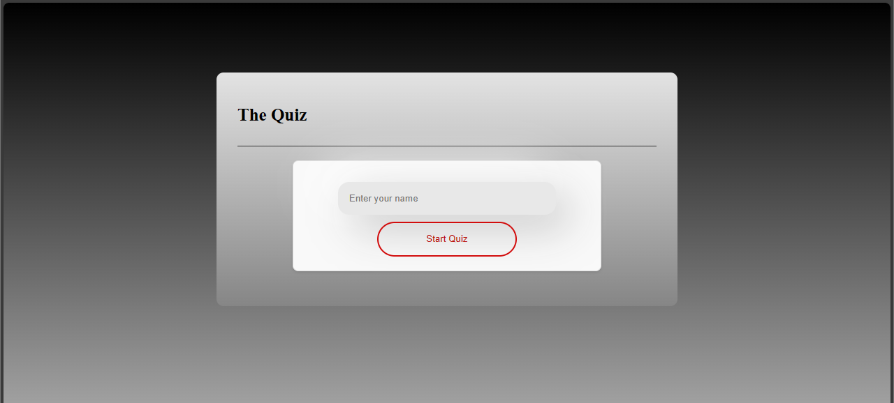

# A2 Quiz



# Solution

Comprehensive web-based quiz application, structured with HTML, CSS, and JavaScript.

The HTML part defines the quiz structure, including input forms for user name, question and answer containers, and buttons for starting, restarting, and displaying high scores.

The JavaScript section is more extensive, implementing the quiz's functionality. It includes event listeners for user interactions, such as starting the game or submitting answers. The quiz logic involves fetching questions from a server, displaying them, and handling user responses. It also features a high score implemented in a separate highScore class, controlling the saving and showing the high score.

The code handles the quiz flow, like showing results, managing high scores (saved in local storage), and restarting the game. The application also includes error handling for incorrect answers and server communication.

# Download and start the game

1. You have to Clone the game to a repo of your choise.
2. When you have done that start by using the following commands:

start with Installing the linters:
```
npm isnatll
```
then run this 
```
npm run build
```

Finally run the game using the following command 
```
npm run http-server dist
```

# How to play
1. Starting the Game: To begin, enter your name in the provided input field and click the "Start Quiz" button.

2. Answering Questions: Once the game starts, you'll be presented with a series of questions, one at a time. Each question can be multiple-choice or text input. For multiple-choice questions, select your answer and click "Submit Answer" or click Enter. For text input questions, type your answer and press Enter or click "Submit".

3. Timer: Each question has a time limit (10 s). Keep an eye on the timer displayed on the screen. If you run out of time before answering, the game ends.

4. Progressing Through Questions: After submitting an answer, the next question will appear. Continue this process until you've answered all questions.

5. Game Over: The game ends either when you answer all questions correctly, submit an incorrect answer, or run out of time.

6. Results and High Scores: At the end of the game, your time and score will be displayed. You can also view the high scores of other players.

7. Restarting the Game: If you wish to play again, click the "Restart Game" button.

Remember, the objective is to answer all questions correctly in the shortest time possible. Good luck!

# how to execute the linters that are part of the development environment and how to execute them.

1. To check that no error in the code use this:
```
npm run lint
```
2. if you want to fix all auto fixable problem use this:
```
npm run stylelint:fix
```